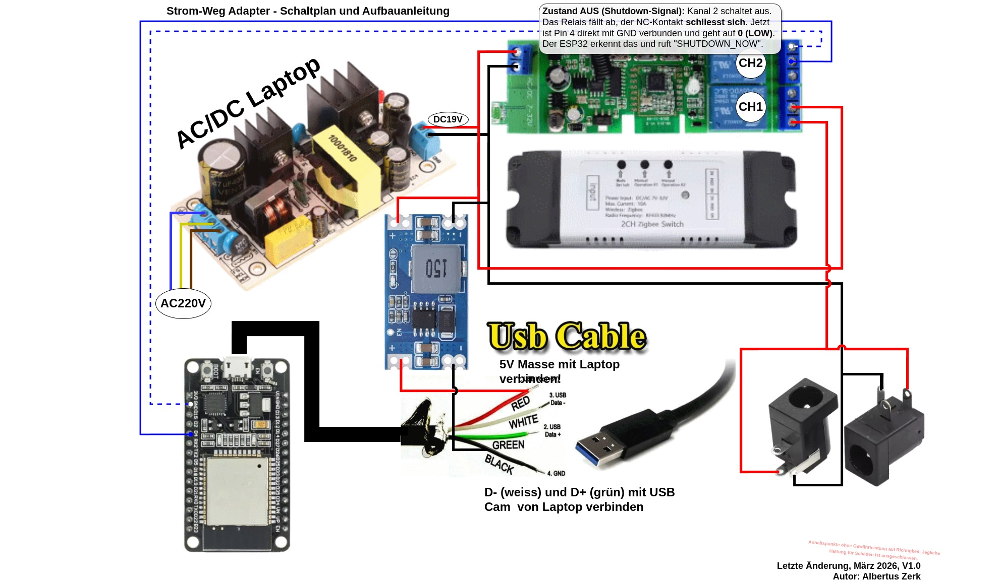
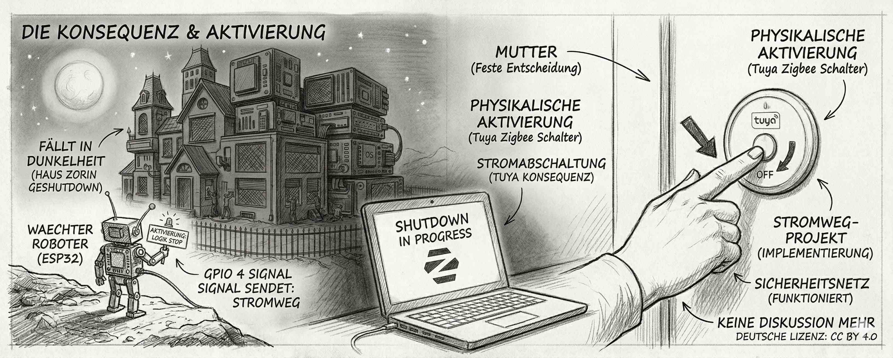

# ⚡ stromweg - Technik als Rueckhalt: Ein Sicherheitsnetz fuer die Familie (v1.0)


## 1. Das Konzept: Die technische Leitplanke fuer bewusste Medienzeiten
Dieses Projekt ist aus einem realen Dilemma des digitalen Alltags entstanden. In einer Zeit, in der Bildschirmzeit, Mediensucht und die ständige Verfügbarkeit von Inhalten grosse Herausforderungen in der Erziehung darstellen, ist `stromweg` weit mehr als eine technische Spielerei.

### Die soziale Komponente
**Ein technisches "Abschalten" von aussen sollte eigentlich NIE notwendig sein.** Kommunikation, Vertrauen und das Pflegen anderer Hobbies (Sport, Natur, analoge Spiele) müssen immer an erster Stelle stehen. 

Dennoch kennen alle Eltern die Situation: Wenn Absprachen nicht fruchten und die digitale Suchtspirale die Oberhand gewinnt, braucht es eine klare, physische Grenze. `stromweg` dient als:
* **Sicherheitsnetz:** Um Hardwareschäden beim harten Stromauszug zu vermeiden.
* **Lernobjekt:** Gemeinsam gebaut, um zu verstehen, wie Befehle und Regeln funktionieren.
* **Letztes Mittel:** Wenn die Konsequenz eines "Strom-Wegs" eintritt, dann soll sie wenigstens sauber und kontrolliert ablaufen.

---

## 2. Die Hardware-Zentrale
Wir nutzen eine **Zwei-Kabel-Loesung**, um Signalstörungen zwischen der 4A-Last und der Datenleitung zu vermeiden.

### Anschluss-Matrix (RJ45 & USB)
| RJ45 Paar (Farbe) | Funktion | Verbindung im Laptop |
| :--- | :--- | :--- |
| **Orange / Weiss** | USB Data (D+ / D-) | Webcam-Stecker Pin D+ & D- |
| **Grün / Weiss** | USB Power (5V / GND) | Webcam-Stecker Pin VCC & GND |
| **Blau / Weiss** | ESP-Signal | ESP32 GPIO 4 & GND |

---

## 3. Bildergalerie
Hier findest du alle visuellen Details zum Nachbauen:

| | | |
| :---: | :---: | :---: |
|  <br> **Schaltplan v1.0** |  <br> **Das nur noch 5 Minuten Dilemma** |  <br> **Die Konsequenz-Schaltung** |
|  <br> **Streit um Screentime** |  <br> **Endstation Safe: Platz für Schach, Karten und wahre Momente** |  <br> **Natur statt Bits** |

---

## 4. Dateien & Download-Übersicht
Hier findest du die Links zu den vollständigen Quelldateien im Repository:

| Datei | Zweck | Ziel-Ort |
| :--- | :--- | :--- |
| [waechter.ino](./waechter.ino) | ESP32 Steuersoftware (Profi-Erzaehler) | ESP32 Board |
| [listener.py](./listener.py) | Python-Shutdown-Empfaenger | `~/.local/bin/` |
| [listener.service](./listener.service) | Systemd Automatisierung | `/etc/systemd/system/` |

---

## 5. Vollständige Skripte (Copy & Paste)

### A. ESP32 Sketch (`waechter.ino`)
```
/* * STROM-WEG ADAPTER - DER WAECHTER (v1.0) */
const int triggerPin = 4;           
const long warteZeit = 5000;         
const long gedankenPause = 20000;    
unsigned long letzteAktionZeit = 0;  
unsigned long letzteGedankenZeit = 0; 
int geschichtenZaehler = 0;          
bool befehlGesendet = false;

void setup() {
  delay(5000); 
  Serial.begin(9600);
  Serial.flush();
  for(int i=0; i<10; i++) { Serial.println(""); }
  pinMode(triggerPin, INPUT_PULLUP);
  Serial.println("******************************************");
  Serial.println("* stromweg - DER WAECHTER (v1.0)         *");
  Serial.println("******************************************");
  letzteGedankenZeit = millis();
}

void loop() {
  unsigned long aktuelleZeit = millis();
  int schalterZustand = digitalRead(triggerPin);

  if (aktuelleZeit - letzteGedankenZeit >= gedankenPause && !befehlGesendet) {
    letzteGedankenZeit = aktuelleZeit; 
    switch (geschichtenZaehler) {
      case 0: Serial.println("[LOG] Ich bewache Pin 4."); break;
      case 1: Serial.println("[LOG] Webcam-Leitung aktiv."); break;
      case 2: Serial.println("[LOG] Zorin OS geht bald ins Bett."); break;
    }
    geschichtenZaehler = (geschichtenZaehler + 1) % 3;
    delay(50); 
  }

  if (schalterZustand == LOW && !befehlGesendet) {
    letzteAktionZeit = aktuelleZeit;
    befehlGesendet = true;
    Serial.println("SHUTDOWN_NOW"); 
    delay(100); 
  }

  if (befehlGesendet && (aktuelleZeit - letzteAktionZeit >= warteZeit)) {
    befehlGesendet = false;
    letzteGedankenZeit = aktuelleZeit; 
  }
}

```


### B. Python Listener (`listener.py`)

```
import serial
import os
import time

port = '/dev/ttyUSB0' 
baud = 9600

try:
    ser = serial.Serial(port, baud, timeout=1)
    time.sleep(2)
    while True:
        if ser.in_waiting > 0:
            line = ser.readline().decode('utf-8').strip()
            if line == "SHUTDOWN_NOW":
                os.system("sudo shutdown -h now")
        time.sleep(1)
except Exception as e:
    with open("/tmp/power_monitor_error.log", "a") as f:
        f.write(f"Fehler: {str(e)}\n")

```

## 6. Setup

📥 Installation (Zorin OS)

```
# Vorbereitung
mkdir -p ~/.local/bin
sudo apt update && sudo apt install python3-serial -y

# Einrichtung (Pfade anpassen!)
cp listener.py ~/.local/bin/
sudo cp listener.service /etc/systemd/system/
sudo systemctl daemon-reload && sudo systemctl enable listener.service && sudo systemctl start listener.service

```

🗑️ Deinstallation (vollständig entfernen)
```
sudo systemctl stop listener.service && sudo systemctl disable listener.service
sudo rm /etc/systemd/system/listener.service
rm ~/.local/bin/listener.py
sudo systemctl daemon-reload
```

## 7. Tuya Szenen-Logik

Um Datenverlust zu vermeiden, muss die Zeitverzögerung exakt eingehalten werden:

1.  **Aktion:** Schalte Kanal 2 (Signal) auf **AUS**.
    
2.  **Warten:** **45 Sekunden** (Laptop fährt kontrolliert runter).
    
3.  **Aktion:** Schalte Kanal 1 (Hauptstrom 4A) auf **AUS**.


## 8. Die Geschichte vom Haus "Zorin" und dem kleinen Waechter 🏠

Stell dir vor, dein Laptop ist ein riesiges, gemütliches **Haus namens Zorin**. In diesem Haus arbeiten hunderte kleine Helfer (die Programme). Sie räumen auf, schreiben Briefe oder spielen Musik.

> [!TIP]
> ### 🛡️ Der Waechter am Gartenzaun (Serial.println)
> Draussen am Gartenzaun sitzt unser kleiner Freund, der **ESP32**. Er ist der Waechter. Er hat eine ganz wichtige Aufgabe: Er passt auf, ob du den grossen **"Feierabend-Knopf"** (den Tuya-Switch) drückst.
> 
> Sobald du drückst, greift der Waechter zu seinem Funkgerät und ruft ganz laut in das USB-Kabel hinein: `SHUTDOWN_NOW!`. Das USB-Kabel ist wie eine **geheime Rohrpost**, die direkt in das Haus Zorin führt.

> [!IMPORTANT]
> ### 👂 Der Lauscher an der Wand (Das Python-Skript)
> Drinnen im Haus Zorin sitzt ein spezieller Helfer direkt am Ende der Rohrpost-Leitung. Das ist unser **Python-Skript**. Er macht den ganzen Tag nichts anderes, als sein Ohr an das Rohr zu halten. Sobald er das Wort `SHUTDOWN_NOW` hört, weiss er: "Oha, jetzt wird es ernst!"

> [!CAUTION]
> ### 📢 Der Befehl an die Putztrupps (os.system)
> Jetzt kommt der Moment mit `os.system("sudo shutdown -h now")`. Das ist für den Python-Helfer so, als würde er eine **goldene Glocke** im Haus läuten und über die Lautsprecher rufen: 
> **"Achtung an alle Helfer! Sofort alles stehen und liegen lassen, Fenster schliessen, Licht ausmachen und ab ins Bett!"**

---

### 🔍 Die magischen Worte im Detail

| Begriff | Bedeutung | Der "Chef-Faktor" |
| :--- | :--- | :--- |
| `sudo` | Der magische Ausweis | "Ich darf das, ich bin der Chef!" |
| `shutdown -h` | Die Abschliess-Aktion | "Haus abschliessen!" |
| `now` | Der Zeitplan | "Nicht erst morgen, sondern SOFORT!" |

---

### Zusammenfassung

| **Code** | **Bedeutung** |
| --- | --- |
| Serial.println | "Ich rufe eine Nachricht in die Leitung!" |
| SHUTDOWN_NOW | Das geheime Codewort. |
| os.system | Der Chef-Befehl an den Computer. |
| sudo shutdown | "Alle Fenster zu, Lichter aus, wir gehen schlafen!" |

---
**Lizenz:** CC BY-NC-SA 4.0

<a href="https://creativecommons.org/licenses/by-nc-sa/4.0/">
  
</a>

Erstellt von Albertus Zerk in Zusammenarbeit mit Gemini. *Version 1.0 (Final) | Maerz 2026.*
